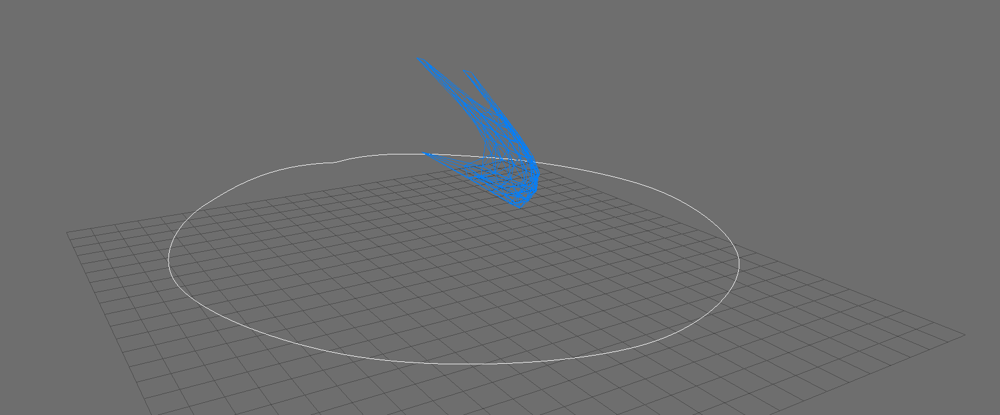
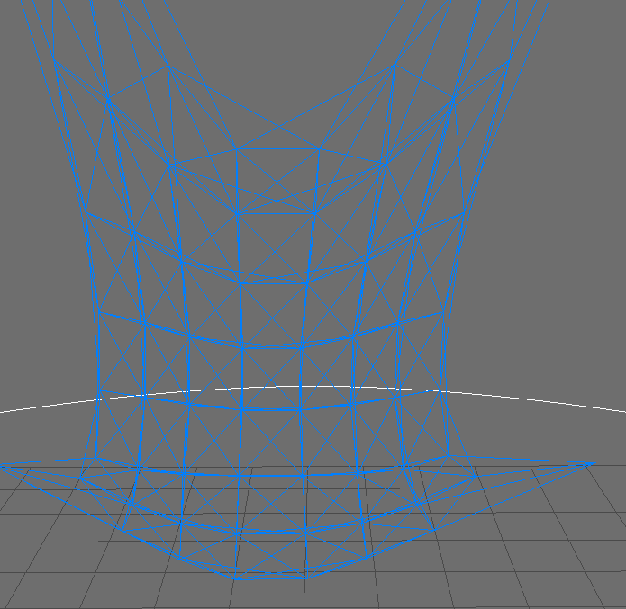

# Cloth

Evan Wilde 2016

This is a simple 12-spring spring-mass cloth simulation. It includes a cloth, a
user-camera, and a spline camera. The user-camera is a full arcball implementation,
allowing rotations on any axis.

## Usage Instructions

### General:

- c: Toggles between the user and spline camera
- f: Toggles the fan
- SPACE: Toggles the simulation

### User Camera:

- CTRL + Middle Mouse Click: Smooth Dolly
- Scroll Wheel: Incremental Dolly
- SHIFT + Middle Mouse Click: Track
- Middle Mouse Click: Rotate View

### Spline Camera:

The spline camera has no user inputs

## Further Explanation

Each inner mass is connected by 12 springs to the other masses. These springs can be
broken down into three sets of four springs. The first set of springs controls the
stretching of the cloth. The second set of springs controls the shearing of the
cloth. The third set of springs controls the bending of the cloth.

The stretch springs connect each mass to the mass directly above, below, right and
left of the mass. The shear springs connect the mass to the masses diagonal to the
mass. The bend springs connect each mass to the mass two above, two below, and two
to the right and left of the mass.

The springs currently use a basic Euler integrator, which can misbehave in rather
dramatic ways if the spring constants and masses are not set to "nice" values.

## Future Work

This probably won't happen, but is probably a good thing to have.

- Add self-collision detection and handling to the cloth.
- Replace the wireframe with a triangulated mesh
- Replace the Euler integrator with something better behaved
